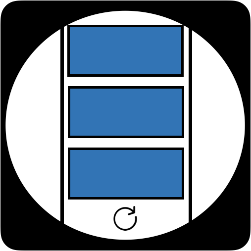

<p align="center">
    <a href="https://seonhyungjo.github.io/react-intinite-component/"></a>

<h1 align="center">React Infinite Scroll Component</h1>

<div align="center">

[](https://www.npmjs.com/package/react-infinite-component) [](https://standardjs.com)


</div>

## Install

```bash
npm install --save react-infinite-component
```

## Usage

```tsx
import * as React from 'react'

import MyComponent from 'react-infinite-component'

class Example extends React.Component {
  render () {
    return (
      <InfiniteScroll loadingFunc={() => fetchDate()} hasMore={this.state.moreFlag} loader={<h4>로딩 중...</h4>}>
          
          
      </InfiniteScroll>
    )
  }
}
```

## License

MIT © :mouse:[snyung](https://github.com/seonhyungjo)
